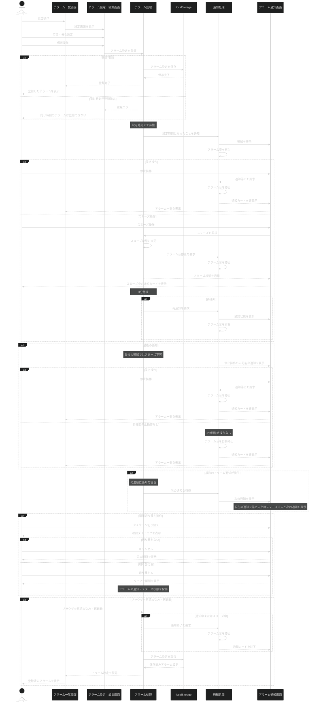

# アラームシーケンス図

```mermaid
%%{init: {
  "theme": "dark"
}}%%

sequenceDiagram

    actor ユーザー
    participant アラーム一覧画面
    participant アラーム設定・編集画面
    participant アラーム処理
    participant localStorage
    participant 通知処理
    participant アラーム通知画面

    %% アラーム登録
    ユーザー->>アラーム一覧画面: 追加操作
    アラーム一覧画面->>アラーム設定・編集画面: 設定画面を表示

    ユーザー->>アラーム設定・編集画面: 時間・分を設定
    ユーザー->>アラーム設定・編集画面: 保存操作

    アラーム設定・編集画面->>アラーム処理: アラーム設定を登録

    alt 登録可能
        アラーム処理->>localStorage: アラーム設定を保存
        localStorage-->>アラーム処理: 保存完了
        アラーム処理-->>アラーム一覧画面: 登録完了
        アラーム一覧画面-->>ユーザー: 登録したアラームを表示

    else 同じ時刻が登録済み
        アラーム処理-->>アラーム設定・編集画面: 重複エラー
        アラーム設定・編集画面-->>ユーザー: 同じ時刻のアラームは登録できない
    end


    %% アラーム通知
    Note over アラーム処理: 設定時刻まで待機

    アラーム処理->>通知処理: 設定時刻になったことを通知
    通知処理->>アラーム通知画面: 通知を表示
    通知処理->>通知処理: アラーム音を再生


    %% 通知への対応
    alt 停止操作

        ユーザー->>アラーム通知画面: 停止操作
        アラーム通知画面->>通知処理: 通知停止を要求
        通知処理->>通知処理: アラーム音を停止
        通知処理-->>アラーム通知画面: 通知カードを非表示
        アラーム通知画面-->>アラーム一覧画面: アラーム一覧を表示

    else スヌーズ操作

        ユーザー->>アラーム通知画面: スヌーズ操作
        アラーム通知画面->>アラーム処理: スヌーズを要求

        アラーム処理->>アラーム処理: スヌーズ状態に変更
        アラーム処理->>通知処理: アラーム音停止を要求
        通知処理->>通知処理: アラーム音を停止

        アラーム処理-->>アラーム通知画面: スヌーズ状態を通知
        アラーム通知画面-->>ユーザー: スヌーズ中の通知カードを表示

        Note over アラーム処理: 3分待機

        alt 再通知

            アラーム処理->>通知処理: 再通知を要求
            通知処理->>アラーム通知画面: 通知状態を更新
            通知処理->>通知処理: アラーム音を再生

        end

    end


    %% 最終通知
    alt 最後の通知

        Note over アラーム処理: 最後の通知ではスヌーズ不可

        通知処理->>アラーム通知画面: 停止操作のみ可能な通知を表示

        alt 停止操作

            ユーザー->>アラーム通知画面: 停止操作
            アラーム通知画面->>通知処理: 通知停止を要求
            通知処理->>通知処理: アラーム音を停止
            通知処理-->>アラーム通知画面: 通知カードを非表示
            アラーム通知画面-->>アラーム一覧画面: アラーム一覧を表示

        else 3分間停止操作なし

            Note over 通知処理: 3分間停止操作なし
            通知処理->>通知処理: アラーム音を自動停止
            通知処理-->>アラーム通知画面: 通知カードを非表示
            アラーム通知画面-->>アラーム一覧画面: アラーム一覧を表示

        end

    end


    %% 複数通知
    alt 複数のアラーム通知が発生

        Note over アラーム処理: 発生順に通知を管理

        アラーム処理->>通知処理: 次の通知を待機
        通知処理->>アラーム通知画面: 次の通知を表示

        Note over アラーム通知画面: 現在の通知を停止またはスヌーズすると次の通知を表示

    end


    %% 画面切り替え
    alt 画面切り替え操作

        ユーザー->>アラーム通知画面: タイマーへ切り替え
        アラーム通知画面-->>ユーザー: 確認ダイアログを表示

        alt 切り替えない

            ユーザー->>アラーム通知画面: キャンセル
            アラーム通知画面-->>ユーザー: 元の画面を表示

        else 切り替える

            ユーザー->>アラーム通知画面: 切り替える
            アラーム通知画面-->>ユーザー: タイマー画面を表示

            Note over アラーム処理: アラームの通知・スヌーズ状態を保持

        end

    end


    %% 再読み込み・再起動
    alt ブラウザを再読み込み・再起動

        ユーザー->>アラーム処理: ブラウザを再読み込み・再起動

        alt 通知中またはスヌーズ中

            アラーム処理->>通知処理: 通知終了を要求
            通知処理->>通知処理: アラーム音を停止
            通知処理-->>アラーム通知画面: 通知カードを終了

        end

        アラーム処理->>localStorage: アラーム設定を取得
        localStorage-->>アラーム処理: 保存済みアラーム設定
        アラーム処理-->>アラーム一覧画面: アラーム設定を復元
        アラーム一覧画面-->>ユーザー: 登録済みアラームを表示

    end
    
```
