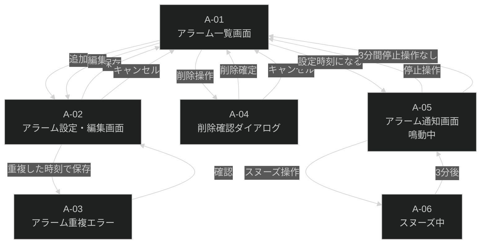

# アラーム画面遷移図

```mermaid
%%{init: {
  "theme": "dark"
}}%%

flowchart TD

A01[A-01<br>アラーム一覧画面]

A02[A-02<br>アラーム設定・編集画面]

A03[A-03<br>アラーム重複エラー]

A04[A-04<br>削除確認ダイアログ]

A05[A-05<br>アラーム通知画面<br>鳴動中]

A06[A-06<br>スヌーズ中]


A01 -->|追加| A02
A02 -->|保存| A01
A02 -->|キャンセル| A01
A02 -->|重複した時刻で保存| A03
A03 -->|確認| A02

A01 -->|編集| A02
A01 -->|削除操作| A04
A04 -->|削除確定| A01
A04 -->|キャンセル| A01

A01 -->|設定時刻になる| A05

A05 -->|停止操作| A01
A05 -->|スヌーズ操作| A06

A06 -->|3分後| A05

A05 -->|3分間停止操作なし| A01
```

