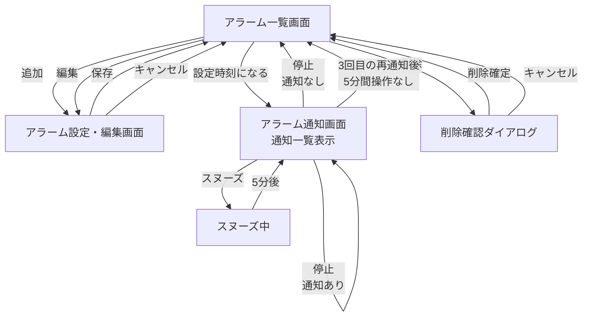

# アラーム画面遷移図

```mermaid
flowchart TD

A[アラーム一覧画面]
B[アラーム設定・編集画面]
D[アラーム通知画面<br>通知一覧表示]
E[スヌーズ中]
F[削除確認ダイアログ]

A -->|追加| B
B -->|保存| A
B -->|キャンセル| A

A -->|編集| B

A -->|削除| F
F -->|削除確定| A
F -->|キャンセル| A

A -->|設定時刻になる| D

D -->|停止<br>通知あり| D
D -->|停止<br>通知なし| A

D -->|スヌーズ| E
E -->|5分後| D

D -->|3回目の再通知後<br>5分間操作なし| A
```