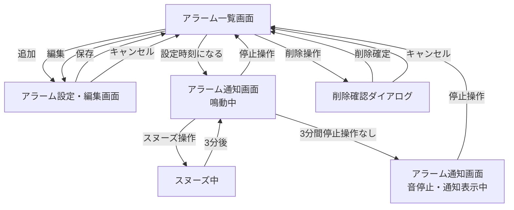

# アラーム画面遷移図

```mermaid
flowchart TD

A[アラーム一覧画面]
B[アラーム設定・編集画面]
D[アラーム通知画面<br>鳴動中]
E[スヌーズ中]
G[アラーム通知画面<br>音停止・通知表示中]
F[削除確認ダイアログ]

A -->|追加| B
B -->|保存| A
B -->|キャンセル| A

A -->|編集| B

A -->|削除操作| F
F -->|削除確定| A
F -->|キャンセル| A

A -->|設定時刻になる| D

D -->|停止操作| A
D -->|スヌーズ操作| E

E -->|3分後| D

D -->|3分間停止操作なし| G
G -->|停止操作| A
```

