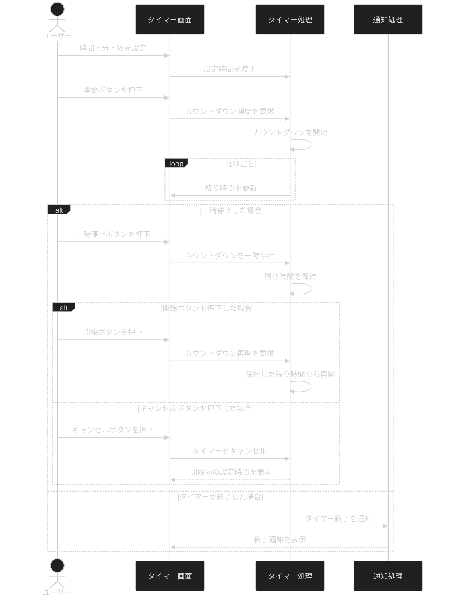

# タイマーシーケンス図

```mermaid
%%{init: {
  "theme": "dark"
}}%%

sequenceDiagram
    actor ユーザー
    participant タイマー画面
    participant タイマー処理
    participant 通知処理

    ユーザー->>タイマー画面: 時間・分・秒を設定
    タイマー画面->>タイマー処理: 設定時間を渡す

    ユーザー->>タイマー画面: 開始ボタンを押下
    タイマー画面->>タイマー処理: カウントダウン開始を要求
    タイマー処理->>タイマー処理: カウントダウンを開始

    loop 1秒ごと
        タイマー処理->>タイマー画面: 残り時間を更新
    end

    alt 一時停止した場合
        ユーザー->>タイマー画面: 一時停止ボタンを押下
        タイマー画面->>タイマー処理: カウントダウンを一時停止
        タイマー処理->>タイマー処理: 残り時間を保持

        alt 開始ボタンを押下した場合
            ユーザー->>タイマー画面: 開始ボタンを押下
            タイマー画面->>タイマー処理: カウントダウン再開を要求
            タイマー処理->>タイマー処理: 保持した残り時間から再開
        else キャンセルボタンを押下した場合
            ユーザー->>タイマー画面: キャンセルボタンを押下
            タイマー画面->>タイマー処理: タイマーをキャンセル
            タイマー処理-->>タイマー画面: 開始前の設定時間を表示
        end

    else タイマーが終了した場合
        タイマー処理->>通知処理: タイマー終了を通知
        通知処理->>タイマー画面: 終了通知を表示
    end

```

