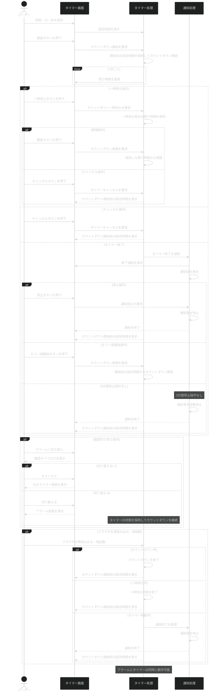

# タイマーシーケンス図

```mermaid
%%{init: {
  "theme": "dark"
}}%%

sequenceDiagram

    actor ユーザー
    participant タイマー画面
    participant タイマー処理
    participant 通知処理

    %% タイマー設定

    ユーザー->>タイマー画面: 時間・分・秒を設定

    タイマー画面->>タイマー処理: 設定時間を渡す


    %% カウントダウン開始

    ユーザー->>タイマー画面: 開始ボタンを押下

    タイマー画面->>タイマー処理: カウントダウン開始を要求

    タイマー処理->>タイマー処理: 開始前の設定時間を保持してカウントダウン開始


    loop 1秒ごと

        タイマー処理->>タイマー画面: 残り時間を更新

    end


    %% カウントダウン中の操作

    alt 一時停止操作

        ユーザー->>タイマー画面: 一時停止ボタンを押下

        タイマー画面->>タイマー処理: カウントダウン一時停止を要求

        タイマー処理->>タイマー処理: 一時停止時点の残り時間を保持


        alt 再開操作

            ユーザー->>タイマー画面: 開始ボタンを押下

            タイマー画面->>タイマー処理: カウントダウン再開を要求

            タイマー処理->>タイマー処理: 保持した残り時間から再開


        else キャンセル操作

            ユーザー->>タイマー画面: キャンセルボタンを押下

            タイマー画面->>タイマー処理: タイマーキャンセルを要求

            タイマー処理-->>タイマー画面: カウントダウン開始前の設定時間を表示

        end


    else キャンセル操作

        ユーザー->>タイマー画面: キャンセルボタンを押下

        タイマー画面->>タイマー処理: タイマーキャンセルを要求

        タイマー処理-->>タイマー画面: カウントダウン開始前の設定時間を表示


    else タイマー終了

        タイマー処理->>通知処理: タイマー終了を通知

        通知処理->>タイマー画面: 終了通知を表示

        通知処理->>通知処理: 通知音を再生


        alt 停止操作

            ユーザー->>タイマー画面: 停止ボタンを押下

            タイマー画面->>通知処理: 通知停止を要求

            通知処理->>通知処理: 通知音を停止

            通知処理-->>タイマー画面: 通知を終了

            タイマー処理-->>タイマー画面: カウントダウン開始前の設定時間を表示


        else もう一度開始操作

            ユーザー->>タイマー画面: もう一度開始ボタンを押下

            タイマー画面->>タイマー処理: カウントダウン再開を要求

            タイマー処理->>タイマー処理: 開始前の設定時間からカウントダウン開始


        else 3分間停止操作なし

            Note over 通知処理: 3分間停止操作なし

            通知処理->>通知処理: 通知音を自動停止

            通知処理-->>タイマー画面: 通知を終了

            タイマー処理-->>タイマー画面: カウントダウン開始前の設定時間を表示

        end

    end


    %% 画面切り替え

    alt 画面切り替え操作

        ユーザー->>タイマー画面: アラームへ切り替え

        タイマー画面-->>ユーザー: 確認ダイアログを表示


        alt 切り替えない

            ユーザー->>タイマー画面: キャンセル

            タイマー画面-->>ユーザー: 元のタイマー画面を表示


        else 切り替える

            ユーザー->>タイマー画面: 切り替える

            タイマー画面-->>ユーザー: アラーム画面を表示

            Note over タイマー処理: タイマーの状態を保持してカウントダウンを継続

        end

    end


    %% 再読み込み・再起動

    alt ブラウザを再読み込み・再起動

        ユーザー->>タイマー処理: ブラウザを再読み込み・再起動


        alt カウントダウン中

            タイマー処理->>タイマー処理: カウントダウンを終了

            タイマー処理-->>タイマー画面: カウントダウン開始前の設定時間を表示


        else 一時停止中

            タイマー処理->>タイマー処理: 一時停止状態を終了

            タイマー処理-->>タイマー画面: カウントダウン開始前の設定時間を表示


        else タイマー鳴動中

            タイマー処理->>通知処理: 通知終了を要求

            通知処理->>通知処理: 通知音を停止

            通知処理-->>タイマー画面: 通知を終了

            タイマー処理-->>タイマー画面: カウントダウン開始前の設定時間を表示

        end

    end


    %% アラームとの同時動作

    Note over タイマー処理: アラームとタイマーは同時に動作可能

```

