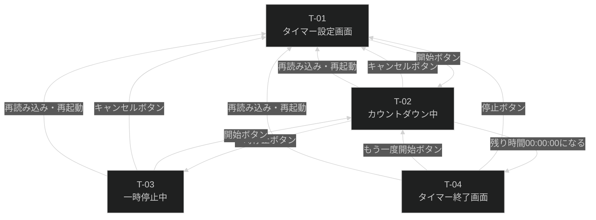

# タイマー画面遷移図

```mermaid
%%{init: {
  "theme": "dark"
}}%%
flowchart TD

T01[T-01<br>タイマー設定画面]
T02[T-02<br>カウントダウン中]
T03[T-03<br>一時停止中]
T04[T-04<br>タイマー終了画面]

T01 -->|開始ボタン| T02
T02 -->|一時停止ボタン| T03
T03 -->|開始ボタン| T02
T02 -->|キャンセルボタン| T01
T03 -->|キャンセルボタン| T01
T02 -->|残り時間00:00:00になる| T04
T04 -->|停止ボタン| T01
T04 -->|もう一度開始ボタン| T02

T02 -->|再読み込み・再起動| T01
T03 -->|再読み込み・再起動| T01
T04 -->|再読み込み・再起動| T01
```

